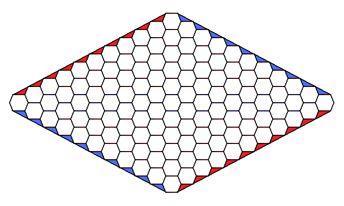

  <h1 align="center">HEX </h1>

  

    <h3>The classic variant of the game Hex is played on an 11 x 11 hexagonal board:</h3>
    <h5>This is a project I wrote as a university project in subject A&DS (Algorithms and Data Structures).</h4>
     
  

  

 # Rules of the game are as follows:
* The game is played by two players (red and blue).
* The starting player is the red player.
* Players take turns placing a piece of their color on any unoccupied space.
* The player who forms a continuous line connecting two edges of the board with their own color wins.
  
More information about this game can be found [here](https://en.wikipedia.org/wiki/Hex_(board_game)).

<h2>INPUT</h2>
 A sequence of test cases, each starting with a drawing of the board's contents followed by a series of queries. The size of the board can vary from 1 to 11. The presence of a red (starting player) pawn is denoted by the letter "r", and a blue pawn by the letter "b". Sample boards may look like this:

    1.)  
         ---
        < r >
         ---

     4.)      ---
           --<   >--
        --< b >-<   >--
     --< r >-<   >-<   >--
    < b >-< b >-<   >-< r >
     --<   >-< r >-< b >--
        --<   >-< r >--
           --<   >--
              ---
      11.)                         ---
                                --<   >--
                             --<   >-< b >--
                          --<   >-<   >-<   >--
                       --<   >-<   >-<   >-<   >--
                    --<   >-<   >-<   >-< b >-< r >--
                 --<   >-<   >-<   >-<   >-<   >-< r >--
              --<   >-<   >-<   >-<   >-< r >-<   >-<   >--
           --< b >-< r >-< r >-<   >-<   >-< b >-<   >-< b >--
        --<   >-<   >-<   >-<   >-< r >-<   >-<   >-< b >-<   >--
     --<   >-< b >-< r >-< r >-< r >-< b >-<   >-<   >-<   >-< r >--
    < b >-<   >-<   >-<   >-<   >-<   >-< b >-<   >-<   >-<   >-< r >
     --< r >-<   >-< b >-< b >-< b >-<   >-<   >-<   >-< b >-< r >--
        --<   >-< r >-< r >-<   >-< b >-< r >-<   >-<   >-<   >--
           --< r >-< b >-<   >-< r >-<   >-<   >-<   >-<   >--
              --<   >-< r >-<   >-<   >-<   >-<   >-<   >--
                 --<   >-< r >-< b >-<   >-< r >-< b >--
                    --< r >-< r >-<   >-<   >-< r >--
                       --<   >-<   >-<   >-< b >--
                          --<   >-<   >-<   >--
                             --<   >-<   >--
                                --< b >--
                                   ---
A query can take the following form:

- BOARD_SIZE - ([sample input](./examples/test1.txt))
- PAWNS_NUMBER - ([sample input](./examples/test2.txt))
- IS_BOARD_CORRECT - ([sample input](./examples/test3.txt))
- IS_GAME_OVER - ([sample input](./examples/test4.txt))
- IS_BOARD_POSSIBLE - ([sample input](./examples/test5.txt))

<h2>OUTPUT</h2>
Possible responses for each test case are as follows:

- BOARD_SIZE - a number from the range <1;11> indicating the size of the board. ([sample output](./examples/output1.txt))
- PAWNS_NUMBER - a number from the range <0;121> indicating the number of pawns of both players on the board. ([sample output](./examples/output2.txt))
- IS_BOARD_CORRECT - a YES/NO response indicating whether the state of the board is correct, in other words, whether the number of pawns of one player is appropriate relative to the number of pawns of the other player. ([sample output](./examples/output3.txt))
- IS_GAME_OVER - a YES RED/YES BLUE/NO response indicating whether (and if so, which) player has ended the game, i.e., whether they have connected two edges of the board with an uninterrupted path of their color. ([sample output](./examples/output4.txt))
- IS_BOARD_POSSIBLE - a YES/NO response indicating whether the state of the board is possible. This means that the board is correct and that achieving such a state did not result in overlooking an earlier win by one of the players. ([sample output](./examples/output5.txt))
